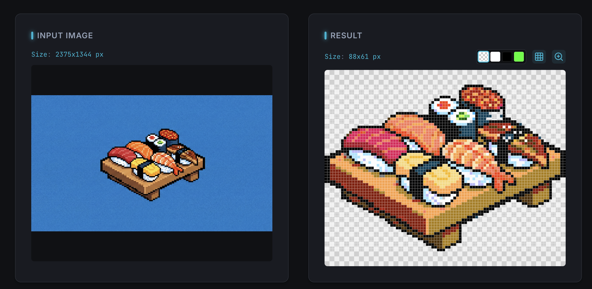

# Pixel Refiner

[English version (English)](./README.md)



### 🚀 今すぐツールを使う: <a href="https://pixel-refiner.app/" target="_blank">pixel-refiner.app</a>

**Pixel Refiner** は、AI生成などで作られたドット絵（ピクセルアート）を、素材として実用的なクオリティに最適化するWebツールです。
アンチエイリアスの除去、グリッドの自動検出、背景透過などの処理をブラウザ上で高速に行います。


## ✨ 特徴

AIで生成したドット絵は、しばしば「ドットがぼやけている（アンチエイリアスがかかっている）」「グリッドがずれている」「背景が不透明」といった問題を抱えています。Pixel Refinerはこれらを解決します。

- **アンチエイリアス除去**: ぼやけたエッジをシャープなドット絵に変換します。
- **グリッド自動検出**: 元画像のドットサイズ（ピクセルグリッド）を自動で検出し、最適なサイズに再サンプリングします。
  - **等倍モード**: グリッド検出を行わず、元画像のピクセルをそのまま扱うモードも搭載。
  - **高速化オプション**: 大きな画像でも素早くプレビューできる高速推定モード。
- **高度な背景透過**:
  - 四隅の色を基準とした自動透過
  - **スポイト機能**: クリックで背景色を直接指定可能
  - 許容差（Tolerance）の調整
  - 「内側の背景」（ドーナツの穴など）の透過
  - 浮きノイズ（孤立点）の自動除去
- **減色・パレット変換**:
  - **レトロゲーム風パレット**: NES (ファミコン), Game Boy, SFC, PC-9801, MSX1, PICO-8 など多数のプリセットを用意。
  - **カスタム減色**: Oklab色空間とK-means法を用いた高品質な減色。
  - **ディザリング**: Floyd-Steinberg, Bayer (2x2, 4x4, 8x8), Ordered など複数のモードに対応。
- **アウトライン生成**: スプライトに自動で縁取り（アウトライン）を追加します。
  - **スタイル**: Rounded (8近傍) または Sharp (4近傍) から選択可能。
  - **色指定**: 任意の色で縁取り可能。
- **自動トリム**: 余白を自動で削除し、コンテンツサイズに合わせます。
- **サイズ強制変換**: 指定した縦横ピクセル数への強制リサイズも可能です。
- **拡大エクスポート**: ゲームエンジン等での利用に合わせて、x2, x4, ... x32 倍に拡大してダウンロードできます。
- **高速な処理**: Web Workerによる非同期処理で、UIをブロックせずに重い画像処理を実行します。

## 📖 使い方

1. アプリケーションを開きます（ローカル起動またはデプロイ先）。
2. ドロップエリアに画像をドラッグ＆ドロップ（またはクリックして選択）します。
3. **「処理を実行」** ボタンを押すと、最適化されたドット絵が生成されます。
4. 必要に応じて設定パネルで以下のパラメータを調整できます：
    - **基本設定**: グリッド検出のON/OFF、高速モードの切り替え
    - **減色・パレット**: プリセット選択、色数指定、ディザリングの適用
    - **背景処理**: 透過モード（自動/手動）、許容差、除去オプション
    - **アウトライン**: スプライトへの縁取り追加
5. **「比較」** ビューを使うと、スライダーで元画像と処理結果を見比べることができます。
6. 処理結果が良ければ **「ダウンロード」** ボタンで保存します（右の▼ボタンから拡大率を選択可能）。

## 🛠️ 開発

このプロジェクトは TypeScript + Vite で構築されています。

### 前提条件

- Node.js (推奨: v18以上)
- npm

### インストール

```bash
git clone https://github.com/HappyOnigiri/PixelRefiner.git
cd PixelRefiner
npm install
```

### 開発サーバーの起動

```bash
npm run dev
```

ブラウザで `http://localhost:5173` にアクセスしてください。

### ビルド

```bash
npm run build
```

`dist` ディレクトリに静的ファイルが出力されます。

### テスト

コアロジック（画像処理部分）の単体テストを実行します。

```bash
npm test
```

## 📂 プロジェクト構成

- `src/browser/`: ブラウザ用UIロジック、メインエントリーポイント
- `src/core/`: 画像処理のコアアルゴリズム（グリッド検出、リサンプリング、透過処理など）
- `src/shared/`: 型定義、定数設定
- `test/`: テストコードとフィクスチャ画像

## 補足

本ツールは画像の自動変換・最適化を主目的としています。そのため、一般的なペイントツールのように1ピクセル単位で手動編集する機能の実装予定はございません。

## ライセンス

このプロジェクトは [MIT License](./LICENSE) の下で公開されています。
