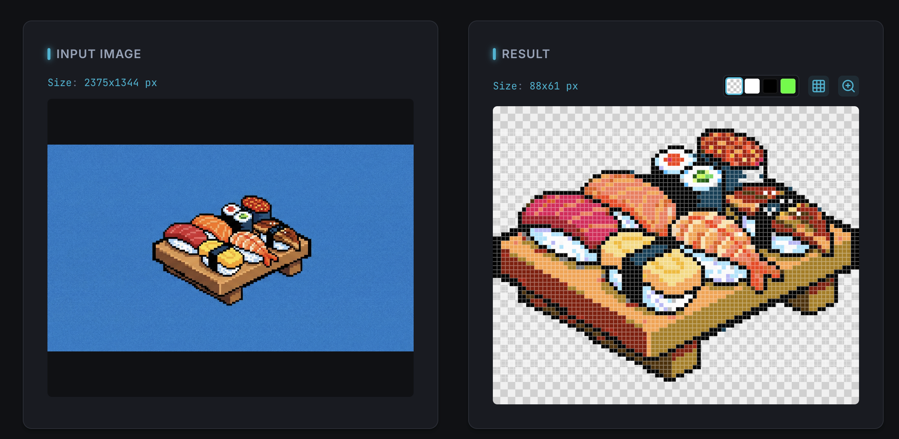

# Pixel Refiner

[English version](./README.md) | [简体中文版](./README.zh-CN.md)



### 🚀 今すぐツールを使う: <a href="https://pixel-refiner.app/" target="_blank">pixel-refiner.app</a>

**Pixel Refiner** は、AI生成などで作られたドット絵（ピクセルアート）を、素材やアイコンとして実用的なクオリティに最適化するWebツールです。
アンチエイリアスの除去、グリッドの自動検出、背景透過処理に加え、複数画像の一括処理もブラウザ上で高速に行います。


## ✨ 特徴

AIで生成したドット絵は、しばしば「ドットがぼやけている（アンチエイリアスがかかっている）」「グリッドがずれている」「背景が不透明」といった問題を抱えています。Pixel Refinerはこれらを解決します。

- **アンチエイリアス除去**: ぼやけたエッジをシャープなドット絵に変換します。
- **高度なグリッド検出**: 元画像のドットサイズ（ピクセルグリッド）を自動で検出し、最適なサイズに再サンプリングします。
  - **グリッド候補選択**: 検出された複数の候補から、最適なサイズをリストから手動で選択可能。
  - **柔軟な検出モード**: **自動検出**、**ピクセル指定+自動(Hint)**、**完全ピクセル指定(Force)**、**無効(等倍)** から選択できます。
  - **高解像度対応**: 大きな画像や複雑なパターンでも、より正確にグリッドを特定できるアルゴリズムを搭載。
  - **高速化オプション**: 大きな画像でも素早くプレビューできる高速推定モード。
- **高度な背景透過**:
  - **自動モード（既定）**: 画像の外周全体から背景を推定し、グラデーションや軽いノイズを含む背景も透過
  - 四隅の色を基準とした透過（手動指定）
  - **スポイト機能**: クリックで背景色を直接指定可能
  - 許容差（Tolerance）の調整
  - 「内側の背景」（ドーナツの穴など）の透過
  - 浮きノイズ（孤立点）の自動除去
- **減色・パレット変換**:
  - **レトロゲーム風パレット**: NES (ファミコン), Game Boy, SFC, PC-9801, MSX1, PICO-8 など多数のプリセットを用意。
  - **カスタム減色**: Oklab色空間とK-means法を用いた高品質な減色。
  - **ディザリング**: Floyd-Steinberg, Bayer (2x2, 4x4, 8x8), Ordered など複数のモードに対応。
- **アウトライン生成**: スプライトに自動で縁取り（アウトライン）を追加します。
  - **スタイル**: Rounded (8近傍) または Sharp (4近傍) から選択可能。
  - **色指定**: 任意の色で縁取り可能。
- **Auto中心の設定**: 処理方法、細かさ、色数、背景、ディザリング、アウトラインを目的ベースで選べ、技術設定は詳細設定から利用できます。
- **用途別プリセット**: Auto、くっきりスプライト、細部を保持、透過アイコン、色数を制限、写真をドット絵化から選び、独自設定も保存できます。
- **自動トリム**: 余白を自動で削除し、コンテンツサイズに合わせます。
- **サイズ強制変換**: 指定した縦横ピクセル数への強制リサイズも可能です。
- **拡大エクスポート**: ゲームエンジン等での利用に合わせて、x2, x4, ... x32 倍に拡大してダウンロードできます。
- **複数画像の一括処理**:
  - **一括アップロード**: 複数のファイルを一度にドラッグ＆ドロップできます。
  - **セッション管理**: 読み込んだ画像の一覧表示、個別の削除、一括クリアが可能です。
  - **一括ダウンロード**: 処理済みの全画像をZIP形式でまとめて保存できます。
  - **一括リサイズ**: ZIPエクスポート時に、全ての画像に特定の拡大率を一括適用できます。
- **高速な処理**: Web Workerによる非同期処理で、UIをブロックせずに重い画像処理を実行します。
- **トースト通知**: プリセットの保存やダウンロード完了などのアクションをリアルタイムに通知します。

## 📖 使い方

1. アプリケーションを開きます（ローカル起動またはデプロイ先）。
2. ドロップエリアに画像をドラッグ＆ドロップ（またはクリックして選択）します。複数枚の同時読み込みにも対応しています。
3. **「画像一覧」** を使って、処理対象の画像を切り替えられます。
4. **「処理を実行」** ボタンを押すか、**「自動」** をONにすると、最適化されたドット絵が生成されます。
5. 用途プリセットを選ぶか、**処理方法**、**細かさ**、**色数**、**背景**、**ディザリング**、**アウトライン**、**自動トリム**を調整します。
6. グリッド、パレット、許容差、連結判定、強制サイズを厳密に指定するときだけ**詳細設定**を開きます。
7. 結果サイズの横で入力分類、採用route、信頼度を確認します。グリッドの信頼度が低い場合だけ候補選択が開きます。
8. **「比較」** ビューを使うと、スライダーで元画像と処理結果を見比べることができます。
9. 処理結果が良ければ **「ダウンロード」** ボタンで保存します（右の▼ボタンから拡大率を選択可能）。
10. 複数枚ある場合は、**「一括ダウンロード (ZIP)」** ボタンから全ての画像をまとめてエクスポートできます。

## 🛠️ 開発

Node.js 24.x と pnpm が必要です。

```bash
pnpm install # 依存関係をインストール
pnpm dev     # 開発サーバーを起動: http://localhost:5173
pnpm build   # 本番用にビルド
pnpm test    # テストを実行
```

### Auto パイプライン

Autoが既定の処理パイプラインです。画像ごとに入力を分類し、グリッド復元、
通常画像の変換、安全な原寸維持から処理経路を選びます。グリッド判定の信頼度が
低い場合は、極端な縮小を確定せず候補選択を表示します。

`pnpm test:quality:report` を実行すると、同じ fixture に対する現在の出力と
ベースラインを比較できます。Pull Requestでも品質ゲートの結果と比較レポートの
要約をGitHub Actionsに掲載します。

## 補足

本ツールは画像の自動変換・最適化を主目的としています。そのため、一般的なペイントツールのように1ピクセル単位で手動編集する機能の実装予定はございません。

## ライセンス

このプロジェクトは [MIT License](./LICENSE) の下で公開されています。
